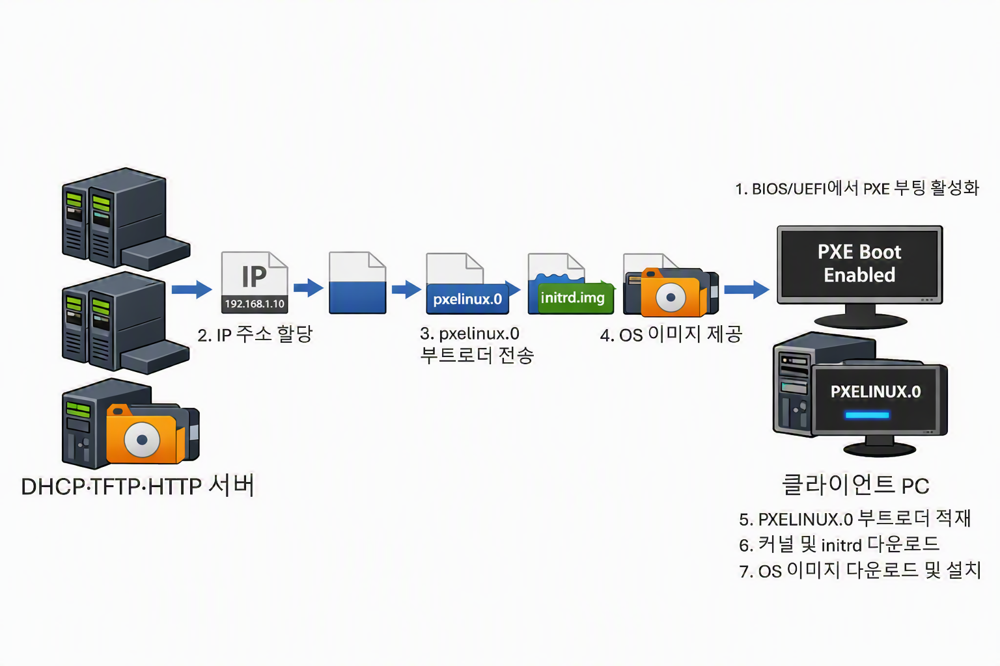

# Linux 무인 설치 서버 구축 스크립트

### Automation Script to Make Pre eXecution Environment Server

##### OS
RedHat Linux - Rocky Linux 9.6 (Blue Onyx)

##### 설명
해당 스크립트 파일은 RedHat Linux를 기준으로 PXE Server 환경을 구축해주는 스크립트입니다.
진행 방법은 main.sh을 실행하고 1 - 5번까지 순서대로 사용하며, 네트워크·사용자명 등을 기입하면 빠르고 간단하게 PXE 서버 환경을 구축할 수 있습니다.
스크립트 내 인공지능의 코드가 없으므로 주석 또는 공식 문서를 필히 참조하는 편이 좋습니다.
사용 디스크나 무인 설치의 상세 변화 등 설정은 공식 문서[RHEL 자동 설치](https://docs.redhat.com/ko/documentation/red_hat_enterprise_linux/8/html/automatically_installing_rhel/index)를 통해 설정할 수 있습니다.

##### Ver
Automation - Only for RedHat Linux 9.6(Blue Onyx)


##### Release Date
2026-07

***

### PXE 서버란?
* 설치 이미지 없이 운영 체제 설치가 가능한 부팅 환경.
* Preboot eXecution Environment의 약자로 BIOS/UEFI에서 설정 가능하다.
* PXE 환경에서는 USB·디스크와 같은 물리 매체가 없어 직접 커널을 적재할 수 없는데, 이는 PXE 초기 파일 시스템 접근이 불가능하기 때문이다.
* 따라서 네트워크로 부트 로더를 받아 실행해야 OS 설치가 가능하다.

##### PXE Host OS 기본 설정:
|준비사항|설명|
|-|-|
|1. ISO 이미지 준비|Rocky Linux 9.6 5.14.0-570.42.2-el9_6.x86_64|
|2. Network|DHCP가 할당 가능한 네트워크(VMware NAT 등)|
|3. 가상 머신의 DHCP 기능 종료|PXE 서버의 원활한 DHCP 할당을 하기 위한 필수 조건|
|4. firewalld 설정|보안을 위해 방화벽을 종료하지 않은 채로 설치해야 한다.|

##### 트러블 슈팅
|오류|원인|해결|
|-|-|-|
|TFTP timeout, 파일 전송 실패| TFTP의 파일 전송용 포트가 방화벽에 의해 차단됨 |방화벽 설정에 TFTP의 포트 추가(69/udp), 파일 전송 효율을 위해 프로토콜을 변경, ftp에서 http로 환경 재구축|
|SCSI 하드디스크 인식 오류| 킥스타트 설정의 하드디스크 설정과 클라이언트의 하드디스크 유형 충돌|클라이언트의 하드디스크를 SCSI에서 킥스타트 설정과 같은 NVMe로 변경(nvme0n1)|
|'설치 원천' 오류|PXE 서버와 Client의 IP 충돌|Kickstart 파일인 'rocky.ks' 파일 내에서 '--bootproto'의 설정인 'static'을 'dhcp'로 변경|
| 그 외 | | 킥스타트 설정 파일과 이미지 파일의 마운트 경로 등 재확인 |

***

##### 흐름
1. 클라이언트 노드에서 BIOS 또는 UEFI의 설정을 통해 PXE 활성화
2. DHCP 서버가 클라이언트에게 IP주소 할당 및 네트워크 초기화
3. TFTP 서버가 syslinux 패키지의 'pxelinux.0' 부트 로더 파일을 클라이언트에게 전송하여 제공
4. 클라이언트는 부트 로더 다운로드하고 메모리 적재
5. 부트 로더가 커널(vmlinuz)과 RAM 디스크(initrd.img)를 다운로드
6. 커널 실행 후, 설치 프로그램이 HTTP로 OS 이미지를 다운로드 및 설치 진행


##### 용어
|용어|설명|
|-|-|
|syslinux|리눅스용 경량 부트 로더 모음으로, PXE 부팅에 필요한 부트 로더 파일들을 포함하고 있다.|
|부트 로더(Boot Loader)|부팅에 필요한 커널과 initrd를 적재하기 위한 프로그램이다.|
|커널(Kernel)|운영체제의 핵심으로 CPU, 메모리, 디스크, 네트워크와 같은 하드웨어 자원을 직접 또는 자동으로 제어할 수 있도록 설계된 프로그램이다.|
|DHCP|같은 네트워크에 있는 노드에게 IP를 자동 할당해주는 프로토콜이며, 이 프로토콜을 통해 PXE 부팅에 필요한 정보를 제공해줄 수 있다.|
|TFTP|인증, 암호화 등이 없어 구현이 단순한 UDP 기반 프로토콜이다. 부트 로더와 같은 경량 파일을 전송하기 적합하다. 따라서 PXE 부팅 표준이다.|
|initrd|Initial RAM Disk의 약자, 임시 루트 파일 시스템으로 작은 OS와 같다. 커널이 완전히 부팅되기 전 필요한 도구가 있고, OS 설치 스크립트를 실행한다.|

***

##### 주요 패키지
|패키지|패키지 설명|사용 이유와 결과|
|-|-|-|
|syslinux|부트 로더 모음|PXE 환경에서는 BIOS/UEFI가 커널과 initrd를 직접 적재할 수 없어 부트 로더가 대신한다.|
|||클라이언트는 부트 로더를 다운로드하고 메모리 적재 뒤 실행한다.|
|dhcp-server|IP 할당 및 부팅 정보 제공|클라이언트는 파일 수신을 위해 네트워크 주소를 할당 받고, OS 설치를 위한 부트 로더 파일의 이름을 전달 받는다.
|||클라이언트에 IP를 할당하고 부트 로더 파일의 이름을 제공한다.|
|tftp-server|부트 로더 파일 제공|PXE ROM이 TCP 스택을 포함하지 않기 때문에 UDP로 부트 로더를 받는다.
|||부팅 전 단계에서 TFTP로 부트 로더를 다운로드한다.|
|httpd|설치용 이미지 파일 제공|PXE 서버가 OS 설치 이미지 파일을 클라이언트에게 제공한다.
|||클라이언트의 커널이 실행된 뒤, 내부 설치 프로그램이 HTTP 프로토콜로 OS 이미지와 설치 파일을 다운로드 한다.|

##### 패키지 설치, 설정부터 테스트까지
1. 주요 패키지 설치
	```bash
		dnf install vim syslinux dhcp-server tftp-server httpd -y
	```

2. 방화벽 설정
	```bash
		# 67, 68, 69번 포트: dhcp handshake, 80번 포트: http
		firewall-cmd --permanent --add-port=67/udp
		firewall-cmd --permanent --add-port=68/udp
		firewall-cmd --permanent --add-port=69/udp
		firewall-cmd --permanent --add-port=80/tcp
		firewall-cmd --reload
	```

3. dhcp 설정 파일 수정
	```bash
		# /etc/dhcpd/dhcpd.conf
		subnet 192.168.10.0	netmask 255.255.255.0 {
			allow booting;
			allow bootp;
			#default-lease-time 600;
			#max-lease-time 7200;
			next-server $_서버주소;
			option routers $_라우팅주소;
			option subnet-mask $_넷마스크;
			option domain-name-servers $_DNS주소;
			range $_할당시작주소	$_할당끝주소;
			filename "pxelinux.0";	# PXE 부팅 필수 파일
		}
	```

4. 이미지 마운트 및 마운트 지점을 PXE 설치 파일 제공용 디렉터리로 변경
	```bash
		mount /dev/cdrom /var/www/html/pub
	```

5. 파일 복사
	```bash
		cp /var/www/html/pub/images/pxeboot/vmlinuz /var/lib/tftpboot/      	# 커널
		cp /var/www/html/pub/images/pxeboot/initrd.img /var/lib/tftpboot/   	# initrd
		cp /var/www/html/pub/isolinux/ldlinux.c32 /var/lib/tftpboot/        	# 부트 로더의 모듈, BIOS에서 사용한다.
		cp /usr/share/syslinux/pxelinux.0 /var/lib/tftpboot/           			# 부트 로더
		cp /root/anaconda-ks.cfg /var/www/html/rocky.ks							# 킥스타트 파일을 'rocky.ks'로 이름 변경하여 복사
	```

6. 부팅 관련 설정 파일 생성
	```bash
		mkdir /var/lib/tftpboot/pxelinux.cfg			# PXE 환경을 위한 pxelinux.cfg 디렉터리 생성
		vim /var/lib/tftpboot/pxelinux.cfg/default		# default 파일 생성

		#/var/lib/tftpboot/pxelinux.cfg/default
		DEFAULT		Rocky9.6 PXE Install
		LABEL			Rocky9.6 PXE Install
		KERNEL			vmlinuz
		APPEND		initrd=initrd.img    inst.repo=http://$서버주소/pub    inst.ks=http://$서버주소/rocky.ks
	```

7. 데몬 재시작 및 자동 실행 활성화
	```bash
		systemctl enable --now dhcpd httpd		# PXE 관련 데몬을 자동 실행으로 등록
		systemctl reload dhcpd httpd			# PXE 관련 데몬 상태 갱신
		#이 때, PXE 설치 파일의 기본 경로는 '/var/www/html/pub'이다.
	```

8. 킥스타트 파일 설정
	>킥스타트 파일이란? 무인화 자동 설치의 설정 파일
	- 킥스타트 파일 복사
	root 디렉터리에 존재하는 킥스타트 설정 파일 'anaconda-ks.cfg'을 설치 파일이 있는 디렉터리와 나란한 위치로 복사.
	파일 복사는 위 단계에서 미리 하였으므로, 자신의 환경과 원하는 설정에 맞도록 킥스타트 파일을 수정해야 한다.
	[킥스타트 파일 설정 공식 문서 'RHEL 자동 설치'](https://docs.redhat.com/ko/documentation/red_hat_enterprise_linux/8/html/automatically_installing_rhel/index)

	- rocky.ks 수정
		```bash
			# 6번 전후 행 "repo --name \~" 을 주석 처리 및 새로운 행 삽입
			url --url=http://192.168.10.100/pub
			repo --name="AppStream" --baseurl=http://192.168.10.100/pub/AppStream

			# 17번 전후 행 'cdrom\~' 주석 처리: TFTP와 HTTP로 이미지의 파일을 PXE 서버로부터 받아 설치하기 때문에 cdrom은 불필요하다.
			#cdrom

			# 19번 전후 행 'network  --bootproto=static\~' 주석 처리 및 새로운 행 추가
			network  --bootproto=dhcp  --hostname=Rocky

			# 20번 전후 행 %packages 하단에 설치 할 패키지 추가
			@^Server with GUI		# 그래픽 서버 환경 그룹
			@GNOME Applications		# GNOME 응용 프로그램
			mc						# Midnight Commander, DOS 느낌이 나는 파일 관리자 
			vim						# VIM

			# 최하단부에 생성할 사용자와 비밀번호 설정
			user --groups=wheel --name=rocky --password=$6$v3fMGgoNZ9KyWltW$XelK3y3GDEZnvpFjCgaECWk2sfokZrTIi/QBASO3r/CKY4hCwreIECsa6/BWZKOnw79oVJznvu9jDTBvNu9NI0 --iscrypted --gecos="rocky"

			# 설치 완료 후 자동 재부팅을 위해 최하단에 reboot 추가
			echo "reboot" >> /var/www/html/rocky.ks

			# 킥스타트 설정 파일 권한 변경
			chmod 644 /var/www/html/rocky.ks
		```

9. 가상머신 생성 및 테스트

***

##### 참고 문헌
###### 도서
- 2023, 우재남, 「*이것이 리눅스다*」, 한빛미디어.
###### 문서
- [GNU Manual](https://www.gnu.org/manual/manual.html)
- [RHEL 자동 설치](https://docs.redhat.com/ko/documentation/red_hat_enterprise_linux/8/html/automatically_installing_rhel/index)
###### 사용 도구
- [Microsoft Copilot](https://copilot.microsoft.com/)